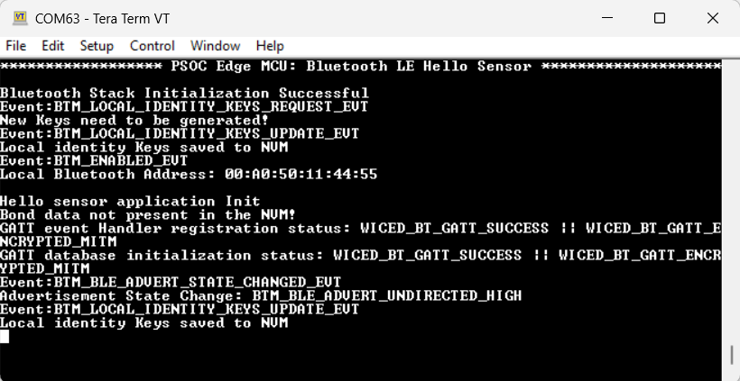
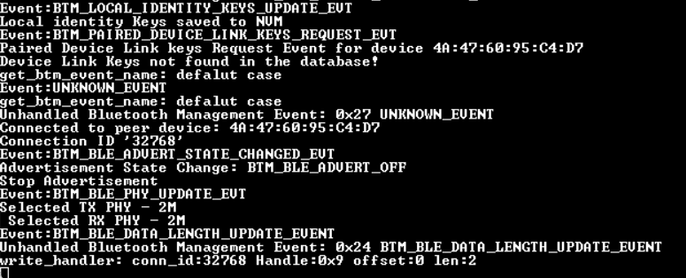
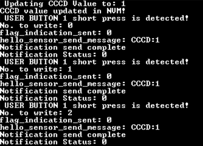
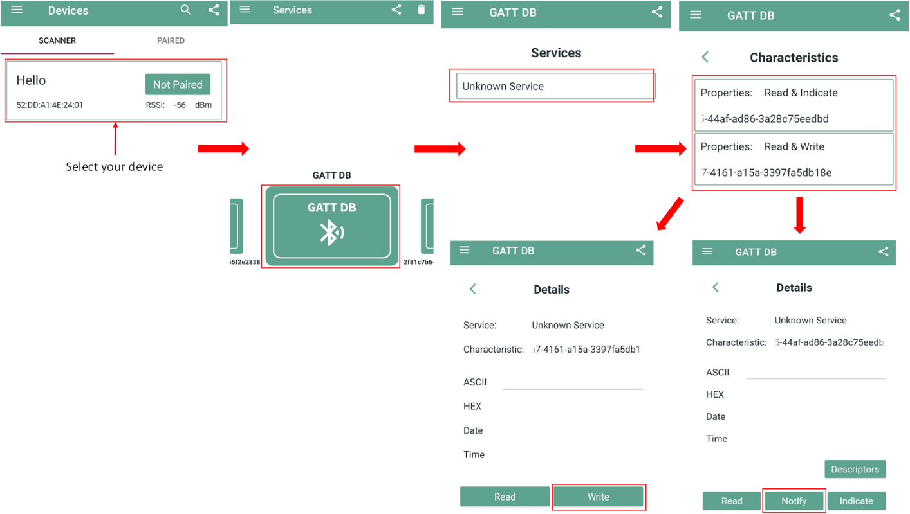
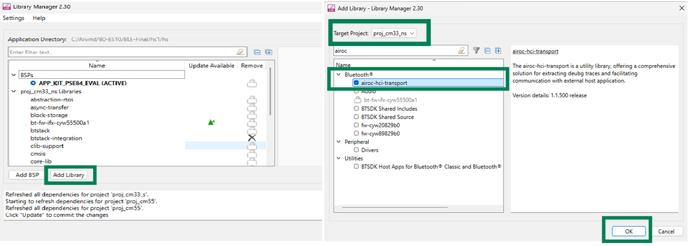
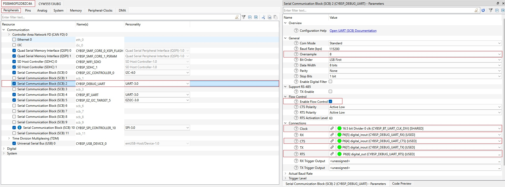
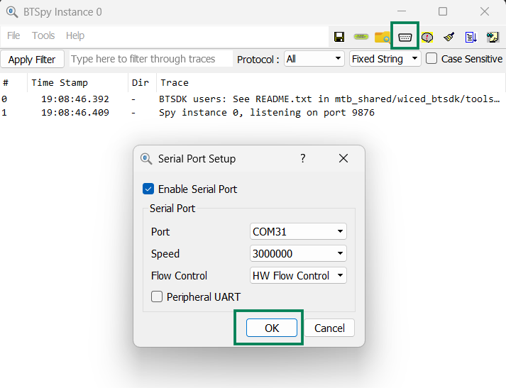
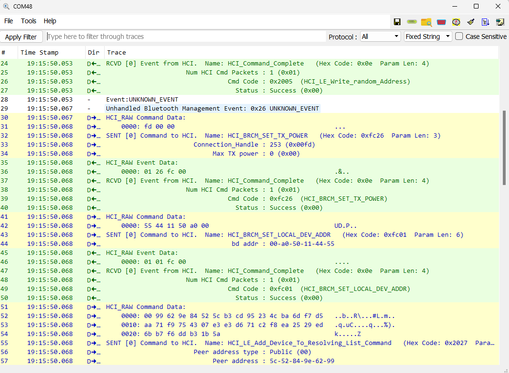

# PSOC&trade; Edge MCU: Bluetooth&reg; LE hello sensor

The code example demonstrates the use of a custom Bluetooth&reg; Low Energy service to send notifications from a peripheral device (PSOC&trade; Edge E84 Evaluation kit) to a central device (smartphone) over a user button press on the peripheral device. Additionally, the code enables the blinking of user LED1 on the peripheral device based on the input provided in the central device. This code example uses PSOC&trade; Edge MCU coupled with AIROC&trade; CYW55513 Wi-Fi & Bluetooth&reg; combo chip in the ModusToolbox&trade; software environment.

This code example has a three project structure: CM33 secure, CM33 non-secure, and CM55 projects. All three projects are programmed to the external QSPI flash and executed in Execute in Place (XIP) mode. Extended boot launches the CM33 secure project from a fixed location in the external flash, which then configures the protection settings and launches the CM33 non-secure application. Additionally, CM33 non-secure application enables CM55 CPU and launches the CM55 application.

[View this README on GitHub.](https://github.com/Infineon/mtb-example-psoc-edge-btstack-hello-sensor)

[Provide feedback on this code example.](https://cypress.co1.qualtrics.com/jfe/form/SV_1NTns53sK2yiljn?Q_EED=eyJVbmlxdWUgRG9jIElkIjoiQ0UyMzkxOTkiLCJTcGVjIE51bWJlciI6IjAwMi0zOTE5OSIsIkRvYyBUaXRsZSI6IlBTT0MmdHJhZGU7IEVkZ2UgTUNVOiBCbHVldG9vdGgmcmVnOyBMRSBoZWxsbyBzZW5zb3IiLCJyaWQiOiJzdXJlc2hrdW1hcmEiLCJEb2MgdmVyc2lvbiI6IjIuMC4wIiwiRG9jIExhbmd1YWdlIjoiRW5nbGlzaCIsIkRvYyBEaXZpc2lvbiI6Ik1DRCIsIkRvYyBCVSI6IklDVyIsIkRvYyBGYW1pbHkiOiJQU09DIn0=)

See the [Design and implementation](docs/design_and_implementation.md) for the functional description of this code example.


## Requirements

- [ModusToolbox&trade;](https://www.infineon.com/modustoolbox) v3.6 or later (tested with v3.6)
- Board support package (BSP) minimum required version: 1.0.0
- Programming language: C
- Associated parts: All [PSOC&trade; Edge MCU](https://www.infineon.com/products/microcontroller/32-bit-psoc-arm-cortex/32-bit-psoc-edge-arm) parts


## Supported toolchains (make variable 'TOOLCHAIN')

- GNU Arm&reg; Embedded Compiler v14.2.1 (`GCC_ARM`) – Default value of `TOOLCHAIN`
- Arm&reg; Compiler v6.22 (`ARM`)
- IAR C/C++ Compiler v9.50.2 (`IAR`)
- LLVM Embedded Toolchain for Arm&reg; v19.1.5 (`LLVM_ARM`)


## Supported kits (make variable 'TARGET')

- [PSOC&trade; Edge E84 Evaluation Kit](https://www.infineon.com/KIT_PSE84_EVAL) (`KIT_PSE84_EVAL_EPC2`) – Default value of `TARGET`
- [PSOC&trade; Edge E84 Evaluation Kit](https://www.infineon.com/KIT_PSE84_EVAL) (`KIT_PSE84_EVAL_EPC4`)


## Hardware setup

This example uses the board's default configuration. See the kit user guide to ensure that the board is configured correctly.

Ensure the following jumper and pin configuration on board.
- BOOT SW must be in the HIGH/ON position
- J20 and J21 must be in the tristate/not connected (NC) position


## Software setup

See the [ModusToolbox&trade; tools package installation guide](https://www.infineon.com/ModusToolboxInstallguide) for information about installing and configuring the tools package.

Install a terminal emulator if you do not have one. Instructions in this document use [Tera Term](https://teratermproject.github.io/index-en.html).

Download and install the AIROC&trade; Bluetooth&reg; Connect App on your [iOS](https://apps.apple.com/in/app/airoc-bluetooth-connect-app/id6443702288) or [Android](https://play.google.com/store/apps/details?id=com.infineon.airocbluetoothconnect) phone.

Scan the following QR codes from your mobile phone to download the AIROC&trade; Bluetooth&reg; Connect App.


This example requires no additional software or tools.


## Operation

See [Using the code example](docs/using_the_code_example.md) for instructions on creating a project, opening it in various supported IDEs, and performing tasks, such as building, programming, and debugging the application within the respective IDEs.

1. Connect the board to your PC using the provided USB cable through the KitProg3 USB connector

2. Open a terminal program and select the KitProg3 COM port. Set the serial port parameters to 8N1 and 115200 baud

3. After programming, the application starts automatically. Observe the Bluetooth&reg; stack and application trace messages on the UART terminal connected via KitProg3 COM port <br>

   **Figure 1** shows the output when,
   
   - The kit is programmed for the first time where the identity keys need to be generated newly and is not available in the NVM <br>
   or 
   - The device has been paired before and the identity keys (bonding information) are cleared by long press with User Button 1

   **Figure 1. Log messages on KitProg3 COM port (device not paired)**

   

   **Figure 2** shows the output when the kit is programmed, where the device was paired before and the identity keys are available in the database

   **Figure 2. Log messages on KitProg3 COM port (device paired)**

   

4. To test using the AIROC&trade; Bluetooth&reg; Connect App, do the following (see the equivalent AIROC&trade; Bluetooth&reg; Connect App screenshot in **Figure 5**):

   1. Turn ON Bluetooth&reg; on your Android or iOS device

   2. Launch the AIROC&trade; Bluetooth&reg; Connect App

   3. Swipe down on the AIROC&trade; Bluetooth&reg; Connect App home screen to start scanning for Bluetooth&reg; LE peripheral devices. Your device named “Hello" displays in the AIROC&trade; Bluetooth&reg; Connect App home screen. Select your device to establish a Bluetooth&reg; LE connection. Once the connection is established, you will see log messages related to connection as follows:

      **Figure 3. Log messages on KitProg3 COM port for connection event**

      

   4. In the **Services** tab, choose the first characteristic to enable notifications/indications. Register for notifications or indications. This will, in turn, initiate the pairing process

   5. Press the User Button 1 in the kit and observe that a notification/indication is being received in the mobile app

      **Figure 4. Log messages on KitProg3 COM port for first characteristic**

      

      **Figure 5. Testing with the AIROC&trade; Bluetooth&reg; Connect App on Android**

      

   6. You can choose the second characteristic, write a numeric value into it, and observe that the USER LED1 on the board will blink as many times as the number written in the 'Blink' characteristic
   
      > **Note:** The numeric value written should range from 0 to 9 only and has to be written in the **Hex** value field and not in the ASCII field

      **Figure 6. Log messages on KitProg3 COM port for second characteristic**

      

5. To forget a bonded device, long press USER BTN1 for 3 seconds. Ensure that the device is not in a connected state before performing this

   After clearing the pairing information, ensure to forget the device named "Hello" from your phone's Bluetooth&reg; settings. If not done the subsequent connection will fail

   **Figure 7. Log messages on KitProg3 COM port for bond erase event**

   


## Enable BTSpy logs

1. **airoc-hci-transport** library is required to enable BTSpy logs. Open Library Manager from Quick Panel, click on Add Library, and add **airoc-hci-transport** under **proj_cm33_ns** as shown in **Figure 8** and click **OK** to update

   **Figure 8. Add hci-airoc-transport library**

   

2. Delete **retarget_io** library from the mtb-shared folder using Library Manager tool.

3. Navigate to the application *Makefile* inside the *proj_cm33_ns*. Find the *Makefile* variable `ENABLE_SPY_TRACES` and set it to the value *1* as shown:
    ```
    ENABLE_SPY_TRACES = 1
    ```
4. Open Device Configurator from the Quick Panel and make the following modifications for **Serial Communication Block (SCB) 2** (under **Peripheral** section) as shown in **Figure 9**
      - Change the **Oversample** value to '8'
      - Select **Enable flow control** to turn on flow control
      - Select the **Clock** as "16.5 bit Divider 0 clk (CYBSP_BT_UART_CLK_DIV)"
      - Select appropriate CTS and RTS pins

   **Figure 9. Enable Flow Control in Debug UART**

   

5. Save the *Makefile* and Device Configurator. Then build and program the application to the board

6. Download and launch the [BTSpy](https://github.com/Infineon/btsdk-utils/tree/master/BTSpy) tool

7. Click on serial port setup and select **Enable Serial Port**. Then select the correct baudrate, port number, and enable hardware flow control as shown in **Figure 10**

   **Figure 10. Enable BTSpy logs**

   

8. Press and release the reset button (XRES) on the board to get the BTSpy logs on the BTSpy tool

   **Figure 11. BTSpy logs**

   

9. For more traces, call the following function in `application main()`

   ```
   cybt_platform_set_trace_level(CYBT_TRACE_ID_STACK,CYBT_TRACE_LEVEL_DEBUG);
   ```
   This function is defined in *cybt_platform_trace.c* in [btstack-integration](https://github.com/Infineon/btstack-integration) <br>
   Set the trace category ID and trace level as per the requirement 

> **Note:** Revert back the changes done in **Step 2** , **Step3** (add retarget_io library back using Library Manager tool) and **Step 4** and delete the **airoc-hci-transport** library using the Library Manager tool to switch back to Debug UART logs from BTSpy logs

### Additional steps for other Bluetooth&reg; Low Energy applications 

Perform the below steps additionally for other code examples. This is already implemented in this (BLE Hello Sensor) code example.

1. Make sure to remove retarget_io related files and header informations from your application

2. Add the below code in the main.c file of CM33_NS project by replacing the existing retarget_io initialization.

   ``` 
   #ifdef ENABLE_BT_SPY_LOG
   #include "cybt_debug_uart.h"
   #endif 

   #ifdef ENABLE_BT_SPY_LOG
   {
      cybt_debug_uart_config_t config =
      {
         .baud_rate = DEBUG_UART_BAUDRATE,
         .flow_control = TRUE
      };
      cybt_debug_uart_init(&config, NULL);
   }
   #else
   {
      /* Initialize retarget-io middleware */
      init_retarget_io();
   }
   #endif
   ```
 
3. Add the below code in event_handler implementation file. In this case it is app_bt_event_handler.c file

   ```
   #ifdef ENABLE_BT_SPY_LOG
   #include "cybt_debug_uart.h"
   #endif

   #ifdef ENABLE_BT_SPY_LOG
   void hci_trace_cback(wiced_bt_hci_trace_type_t type, uint16_t length, 
   uint8_t* p_data)
   {
      cybt_debug_uart_send_hci_trace(type, length, p_data);
   }
   #endif

   /* place the below code inside app_bt_application_init()   
     or similar function */

   #ifdef ENABLE_BT_SPY_LOG
   wiced_bt_dev_register_hci_trace(hci_trace_cback);
   #endif
   ```
4. Add the below define in the makefile of CM33_NS project. 

   ```
   # Optionally enable app and Bluetooth protocol traces and route to BTSpy
   ENABLE_SPY_TRACES = 1
   ifeq ($(ENABLE_SPY_TRACES),1)
   DEFINES+=ENABLE_BT_SPY_LOG DEBUG_UART_BAUDRATE=3000000
   else
   DEFINES+=ENABLE_AIROC_HCI_TRANSPORT_PRINTF=0
   endif
   ```
   

## Resources and settings

This section explains the ModusToolbox&trade; software resources and their configurations as used in this code example. Note that all the configuration explained in this section has already been implemented in the code example.

- **Bluetooth&reg; Configurator:** The Bluetooth&reg; peripheral has a configurator called the “Bluetooth&reg; Configurator” that is used to generate the Bluetooth&reg; LE GATT database and various Bluetooth&reg; settings for the application. These settings are stored in the file named *design.cybt*.

See the [Bluetooth&reg; Configurator guide](https://www.infineon.com/ModusToolboxBLEConfig) for more details.


## Related resources

Resources  | Links
-----------|----------------------------------
Application notes  | [AN235935](https://www.infineon.com/AN235935) – Getting started with PSOC&trade; Edge E8 MCU on ModusToolbox&trade; software <br> [AN236697](https://www.infineon.com/AN236697) – Getting started with PSOC&trade; MCU and AIROC&trade; Connectivity devices
Code examples  | [Using ModusToolbox&trade;](https://github.com/Infineon/Code-Examples-for-ModusToolbox-Software) on GitHub
Device documentation | [PSOC&trade; Edge MCU datasheets](https://www.infineon.com/products/microcontroller/32-bit-psoc-arm-cortex/32-bit-psoc-edge-arm#documents) <br> [PSOC&trade; Edge MCU reference manuals](https://www.infineon.com/products/microcontroller/32-bit-psoc-arm-cortex/32-bit-psoc-edge-arm#documents)
Development kits | Select your kits from the [Evaluation board finder](https://www.infineon.com/cms/en/design-support/finder-selection-tools/product-finder/evaluation-board)
Libraries  | [mtb-dsl-pse8xxgp](https://github.com/Infineon/mtb-dsl-pse8xxgp) – Device support library for PSE8XXGP <br> [retarget-io](https://github.com/Infineon/retarget-io) – Utility library to retarget STDIO messages to a UART port <br> [btstack-integration](https://github.com/Infineon/btstack-integration) – The btstack-integration hosts platform adaptation layer (porting layer) between AIROC&trade; BTSTACK and Infineon's different hardware platforms <br> [kv-store](https://github.com/Infineon/kv-store) – This library provides a convenient way to store information as key-value pairs in non-volatile storage
Tools  | [ModusToolbox&trade;](https://www.infineon.com/modustoolbox) – ModusToolbox&trade; software is a collection of easy-to-use libraries and tools enabling rapid development with Infineon MCUs for applications ranging from wireless and cloud-connected systems, edge AI/ML, embedded sense and control, to wired USB connectivity using PSOC&trade; Industrial/IoT MCUs, AIROC&trade; Wi-Fi and Bluetooth&reg; connectivity devices, XMC&trade; Industrial MCUs, and EZ-USB&trade;/EZ-PD&trade; wired connectivity controllers. ModusToolbox&trade; incorporates a comprehensive set of BSPs, HAL, libraries, configuration tools, and provides support for industry-standard IDEs to fast-track your embedded application development

<br>


## Other resources

Infineon provides a wealth of data at [www.infineon.com](https://www.infineon.com) to help you select the right device, and quickly and effectively integrate it into your design.


## Document history

Document title: *CE239199* – *PSOC&trade; Edge MCU: Bluetooth&reg; LE hello sensor*

 Version | Description of change
 ------- | ---------------------
 1.x.0   | New code example <br> Early access release
 2.0.0   | GitHub release
<br>


All referenced product or service names and trademarks are the property of their respective owners.

The Bluetooth&reg; word mark and logos are registered trademarks owned by Bluetooth SIG, Inc., and any use of such marks by Infineon is under license.

PSOC&trade;, formerly known as PSoC&trade;, is a trademark of Infineon Technologies. Any references to PSoC&trade; in this document or others shall be deemed to refer to PSOC&trade;.

---------------------------------------------------------

© Cypress Semiconductor Corporation, 2023-2025. This document is the property of Cypress Semiconductor Corporation, an Infineon Technologies company, and its affiliates ("Cypress").  This document, including any software or firmware included or referenced in this document ("Software"), is owned by Cypress under the intellectual property laws and treaties of the United States and other countries worldwide.  Cypress reserves all rights under such laws and treaties and does not, except as specifically stated in this paragraph, grant any license under its patents, copyrights, trademarks, or other intellectual property rights.  If the Software is not accompanied by a license agreement and you do not otherwise have a written agreement with Cypress governing the use of the Software, then Cypress hereby grants you a personal, non-exclusive, nontransferable license (without the right to sublicense) (1) under its copyright rights in the Software (a) for Software provided in source code form, to modify and reproduce the Software solely for use with Cypress hardware products, only internally within your organization, and (b) to distribute the Software in binary code form externally to end users (either directly or indirectly through resellers and distributors), solely for use on Cypress hardware product units, and (2) under those claims of Cypress's patents that are infringed by the Software (as provided by Cypress, unmodified) to make, use, distribute, and import the Software solely for use with Cypress hardware products.  Any other use, reproduction, modification, translation, or compilation of the Software is prohibited.
<br>
TO THE EXTENT PERMITTED BY APPLICABLE LAW, CYPRESS MAKES NO WARRANTY OF ANY KIND, EXPRESS OR IMPLIED, WITH REGARD TO THIS DOCUMENT OR ANY SOFTWARE OR ACCOMPANYING HARDWARE, INCLUDING, BUT NOT LIMITED TO, THE IMPLIED WARRANTIES OF MERCHANTABILITY AND FITNESS FOR A PARTICULAR PURPOSE.  No computing device can be absolutely secure.  Therefore, despite security measures implemented in Cypress hardware or software products, Cypress shall have no liability arising out of any security breach, such as unauthorized access to or use of a Cypress product. CYPRESS DOES NOT REPRESENT, WARRANT, OR GUARANTEE THAT CYPRESS PRODUCTS, OR SYSTEMS CREATED USING CYPRESS PRODUCTS, WILL BE FREE FROM CORRUPTION, ATTACK, VIRUSES, INTERFERENCE, HACKING, DATA LOSS OR THEFT, OR OTHER SECURITY INTRUSION (collectively, "Security Breach").  Cypress disclaims any liability relating to any Security Breach, and you shall and hereby do release Cypress from any claim, damage, or other liability arising from any Security Breach.  In addition, the products described in these materials may contain design defects or errors known as errata which may cause the product to deviate from published specifications. To the extent permitted by applicable law, Cypress reserves the right to make changes to this document without further notice. Cypress does not assume any liability arising out of the application or use of any product or circuit described in this document. Any information provided in this document, including any sample design information or programming code, is provided only for reference purposes.  It is the responsibility of the user of this document to properly design, program, and test the functionality and safety of any application made of this information and any resulting product.  "High-Risk Device" means any device or system whose failure could cause personal injury, death, or property damage.  Examples of High-Risk Devices are weapons, nuclear installations, surgical implants, and other medical devices.  "Critical Component" means any component of a High-Risk Device whose failure to perform can be reasonably expected to cause, directly or indirectly, the failure of the High-Risk Device, or to affect its safety or effectiveness.  Cypress is not liable, in whole or in part, and you shall and hereby do release Cypress from any claim, damage, or other liability arising from any use of a Cypress product as a Critical Component in a High-Risk Device. You shall indemnify and hold Cypress, including its affiliates, and its directors, officers, employees, agents, distributors, and assigns harmless from and against all claims, costs, damages, and expenses, arising out of any claim, including claims for product liability, personal injury or death, or property damage arising from any use of a Cypress product as a Critical Component in a High-Risk Device. Cypress products are not intended or authorized for use as a Critical Component in any High-Risk Device except to the limited extent that (i) Cypress's published data sheet for the product explicitly states Cypress has qualified the product for use in a specific High-Risk Device, or (ii) Cypress has given you advance written authorization to use the product as a Critical Component in the specific High-Risk Device and you have signed a separate indemnification agreement.
<br>
Cypress, the Cypress logo, and combinations thereof, ModusToolbox, PSoC, CAPSENSE, EZ-USB, F-RAM, and TRAVEO are trademarks or registered trademarks of Cypress or a subsidiary of Cypress in the United States or in other countries. For a more complete list of Cypress trademarks, visit www.infineon.com. Other names and brands may be claimed as property of their respective owners.