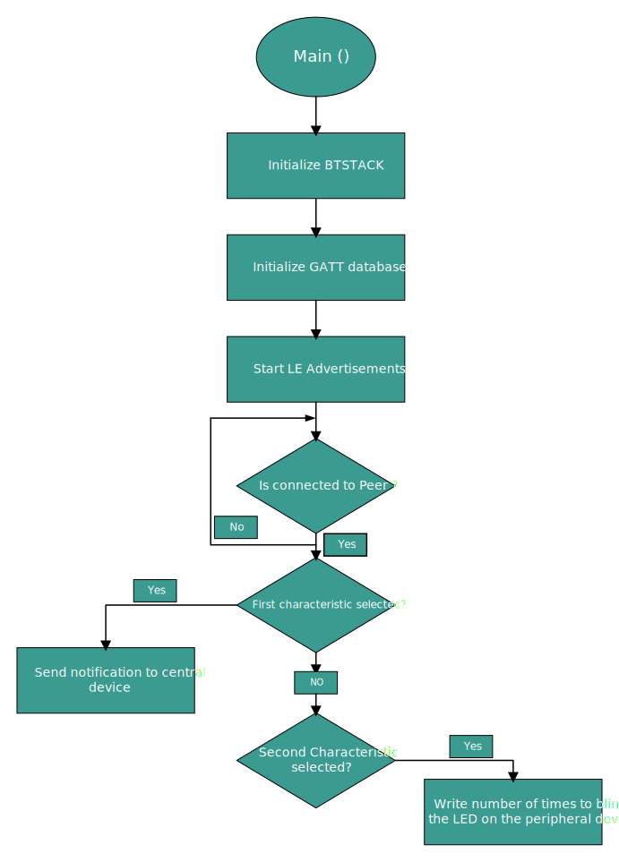

[Click here](../README.md) to view the README.

## Design and implementation

The design of this application is minimalistic to get started with code examples on PSOC&trade; Edge MCU devices. All PSOC&trade; Edge E84 MCU applications have a dual-CPU three-project structure to develop code for the CM33 and CM55 cores. The CM33 core has two separate projects for the secure processing environment (SPE) and non-secure processing environment (NSPE). A project folder consists of various subfolders, each denoting a specific aspect of the project. The three project folders are as follows:

**Table 1. Application projects**

Project | Description
--------|------------------------
*proj_cm33_s* | Project for CM33 secure processing environment (SPE)
*proj_cm33_ns* | Project for CM33 non-secure processing environment (NSPE)
*proj_cm55* | CM55 project

 

In this code example, at device reset, the secure boot process starts from the ROM boot with the secure enclave (SE) as the root of trust (RoT). From the secure enclave, the boot flow is passed on to the system CPU subsystem where the secure CM33 application starts. After all necessary secure configurations, the flow is passed on to the non-secure CM33 application. Resource initialization for this example is performed by this CM33 non-secure project. It configures the system clocks, pins, clock to peripheral connections, and other platform resources. It then enables the CM55 core using the `Cy_SysEnableCM55()` function and the CM55 core is subsequently put to DeepSleep mode.

In the CM33 non-secure application, the clocks and system resources are initialized by the BSP initialization function. The retarget-io middleware is configured to use the debug UART. Platform-specific settings for the Bluetooth&reg; device are configured, BTSTACK is initialized, and callback functions are registered. Events handlers are written to handle the BTSTACK callback events.

The code example configures the device as a Bluetooth&reg; LE Generic Access Profile (GAP) Peripheral and Generic Attribute Profile (GATT) Server. The example implements a custom GATT service called "Hello_Sensor" service and has two custom characteristics: Notify and Blink. The Notify characteristic sends a notification or indication to the peer client device upon button press events. The Blink characteristic is used by the peer client to write the number of times the onboard user USER_LED1 should blink.

Upon reset, the application starts automatically and initializes BTSTACK and other device peripherals. The device starts to advertise its presence to the peer client devices. Once a Bluetooth&reg; LE connection is established, the peer client device can register for notifications/indications to be received using the CCCD handle of the Notify characteristic. Because the CCCD handle of the Notify characteristic requires write authentication, an attempt to enable notification/indication will trigger the pairing process at the Central side. Once the pairing process completes, the peer device's link keys and addresses are stored in the device's non-volatile memory (NVM) and therefore bonded.

The buttons, such as User Button 1 and User Button 2 on the board have been set up to generate an interrupt upon being pressed, and it can perform the following functions when pressed.

- **USER Button 1 (SW2):** Press the **USER Button 1** to start undirected high advertisements if no connection exists. If a connection exists and notifications/indications are enabled, sends a notification/indication packet to the peer client device

- **USER Button 2 (SW4):** Press the **USER Button 2** to enter pairing mode. In pairing mode, you can connect to a new peer device

- **Long press User Button 1 (SW2) for 3 seconds:** Long press the **User Button 1** for 3 seconds to erase the bonding/pairing information from the non-volatile memory of the device

> **Note:** Disconnect the device from the peer client device before erasing the bonding information from the non-volatile memory.

The peer client can also write the number of times the USER LED1 on the board blinks using the Blink characteristic.

**Figure 1. Hello sensor process flowchart**

   

 